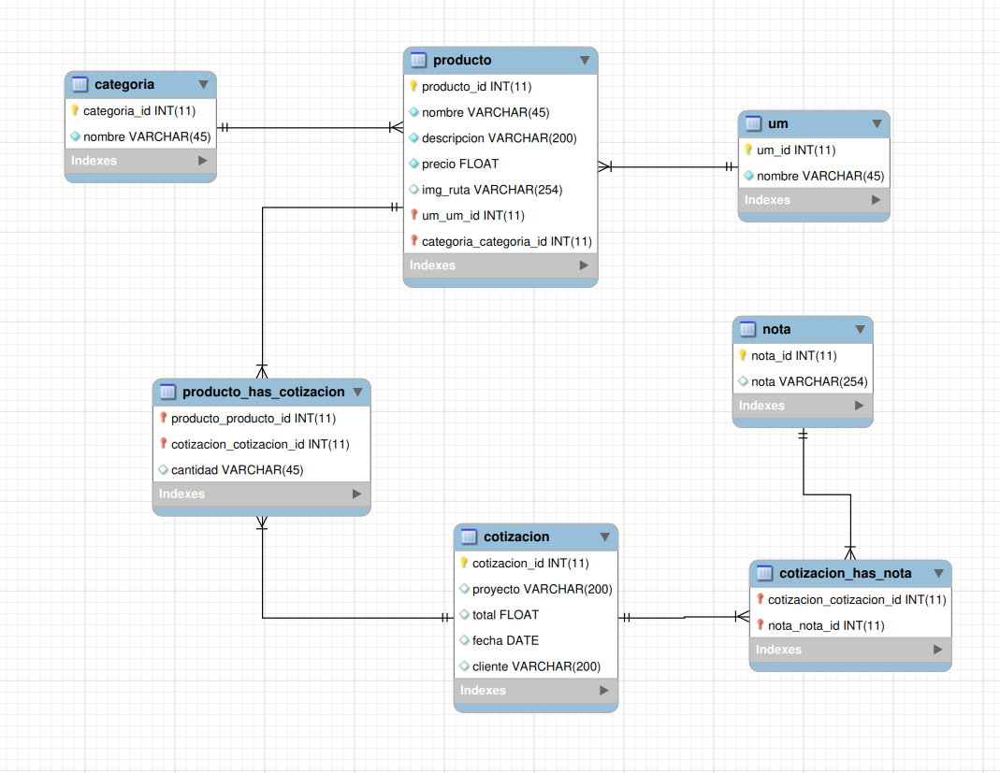

# Base de Datos

## Importar la base de datos
Importa la base de datos desde el archivo `database.sql`



## Configuración de conexión
Configura los parámetros de conexión en el archivo `Database.php` ubicado en la carpeta `core`.

Ejemplo de configuración:

```php
private static $servername = "localhost";
private static $username = "root";
private static $password = "";
private static $dbname = "nombre_de_la_base";