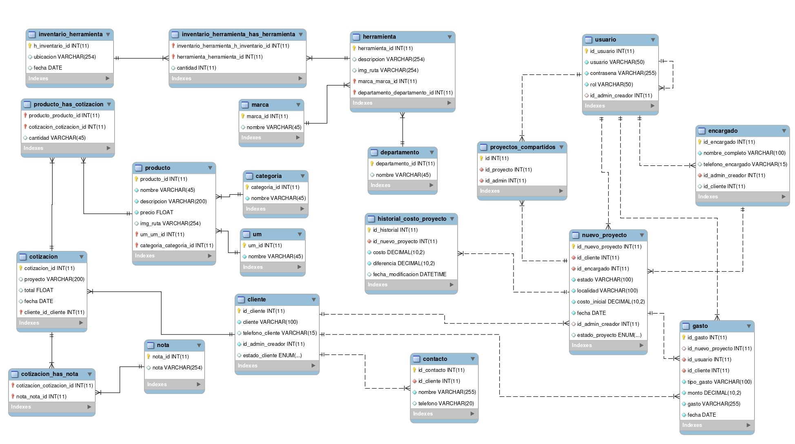

# Base de Datos

## Importar la base de datos
Importa la base de datos desde el archivo `database.sql`



## Configuración de conexión
Configura los parámetros de conexión en el archivo `config.php` ubicado en la carpeta `db`.

Ejemplo de configuración:

```php
public static $DB_HOST = 'localhost';
public static $DB_NAME = 'local_db';
public static $DB_USER = 'root';
public static $DB_PASS = '';
